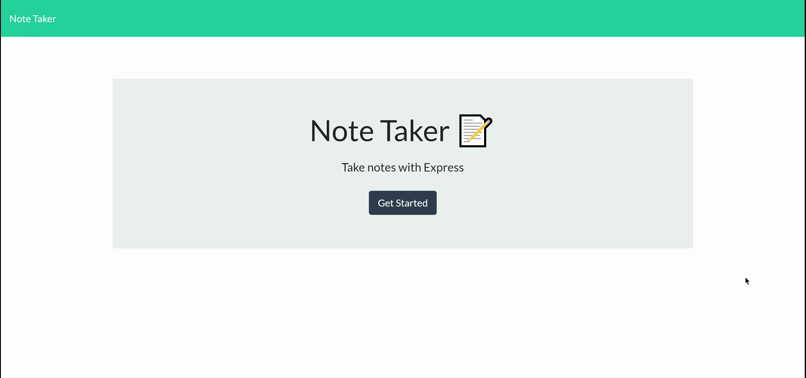
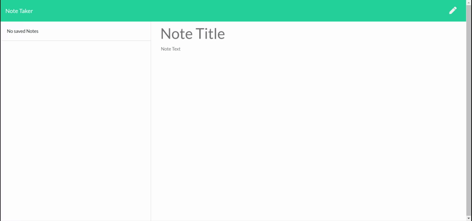
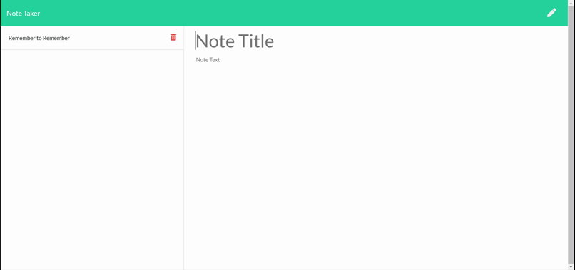
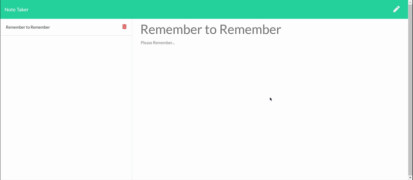

# Note Taker

URL: https://sheltered-ocean-89467.herokuapp.com/
GitHub Repo: https://github.com/Samwise2980/note-taker

## Description

A simple note taker that will let the user type notes out and stores them to the server. The user can delete notes with a simple button as well once they are done with them.

## Table of Contents

- [Usage](#usage)
- [Tests](#tests)
- [Questions](#questions)

## Usage

When you first visit the web app, you will be shown the landing page. On the landing page you can click on 'Get Started' to take you to the notes page.

Once on the notes page you will be presented with a form to fill a title for the note and the body of the note. When you are done typing out your note, you can click the save icon to save the note to the server for viewing.

When you click on the note title on the left side of the page, you will expand the note and a see the contentes of that note.

When you are done with that note, you can click the trashcan icon to remove it for good!

## Tests

There is a test note in the server database to load once you get to the notes page. There is also a 'Hello, World!' note left on the Heroku page as well.

## Questions

If you have any questions please contact me at:

Email: samuelfoster0@gmail.com

